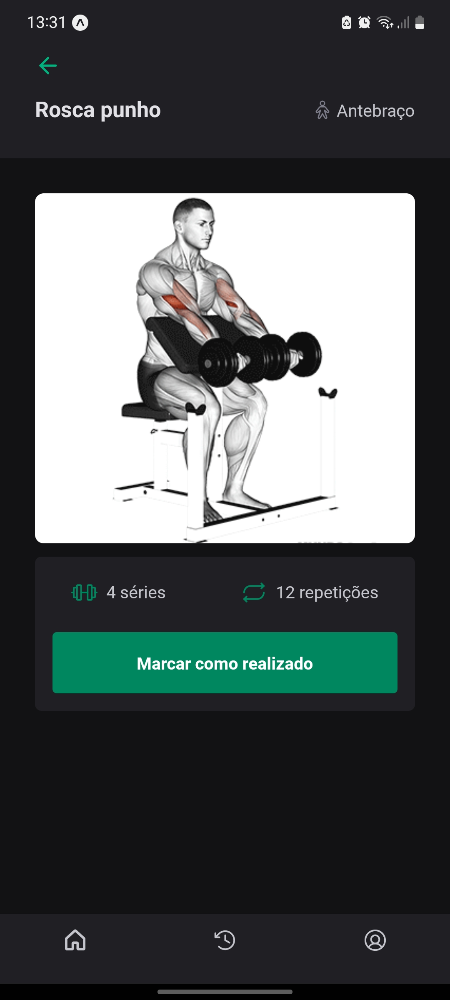

# Ignite Gym - Ignite | Rocketseat

## Português

#### Aplicativo de acompanhamento de treinos de academia

A aplicação foi desenvolvida em React Native com Expo e NativeBase utilizando o design disponibilizado através do Figma. Nela o usuário pode criar uma conta e fazer login, visualizar exercícios de acordo com a categoria, selecionar um exercício para visualizar detalhes e maneira de executar, visualizar quantidade de séries e repetições, marcar como realizado, visualiar histórico de exercícios realizados e verificar e editar informações do perfil, como foto, nome e senha.

## English

#### Gym workout tracking app

The application was developed in React Native with Expo and NativeBase using the design made available through Figma. In it the user can create an account and log in, view exercises according to the category, select an exercise to view details and how to perform, view number of series and repetitions, mark as performed, view history of exercises performed and check and edit profile information such as photo, name and password.

## Screenshots

    

        
        
        
        
        
        
    

## Stack

 